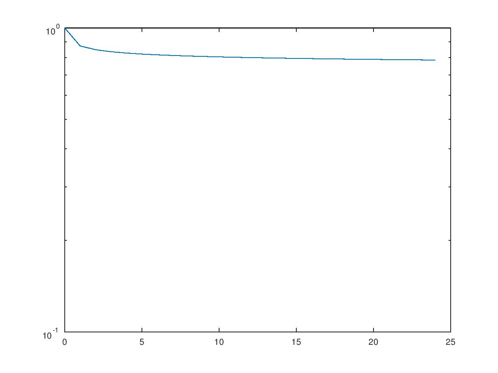

## Report

姓名：佘国榛

学号：15307130224

Preview:

All the codes are written in matlab 

#### 1 (30 points) Logistic Regression

#### 1.1 (10 points) Bayes’ Rule

$$P(y=1|x) = \frac{p(y=1)p(x|y=1)}{p(x)}$$

​		 $$= \frac{\alpha p(x|y=1)}{\alpha p(x|y=1)+(1-\alpha) p(x|y=0)}$$

​		$$=\frac{1}{1+\frac{1-\alpha}{\alpha} \frac{p(x|y=0)}{p(x|y=1)}}$$

​	        $$= \frac{1}{1+\frac{1-\alpha}{\alpha} \frac{\prod p(x=x_j|y=0)}{\prod p(x=x_j|y=1)}}$$

Based on the fact that $$p(x=x_j|y=0) = \frac{1}{\sqrt{2 \pi \sigma^2}} e^{-\frac{(x_j-\mu_{j,i})^2}{2\sigma_j^2}{}}$$

We can deduct the answer that:

​		$$P(y=1|x) = \frac{1}{1+e^{\Sigma -\frac{(\mu_{j0}-\mu_{j1})}{\sigma_j}x_j- \frac{\mu_{j0}^2-\mu_{j1}^2}{2\sigma_j^2}-+ln{\frac{1-\alpha}{\alpha}}}}$$

So we can get the value of **w** and **b**

$$w_j = \frac{(\mu_{j0}-\mu_{j1})}{\sigma_j}$$

$$b = \frac{(\mu_{j0}-\mu_{j1})^2}{2\sigma^2} - ln{\frac{1-\alpha}{\alpha}}$$ 


1.2

$$E( \vec{w}, b ) = -log\prod_{n=1}^{N}P(y=1|\vec{x}^{(n)}, \vec{w},b)^{y_n} (1-P(y=1|\vec{x}^{(n)},\vec{w},b))^{(1-y_n)}$$

​	    $$= -\Sigma_{n=1}^{N}y_n logP(y=1|\vec{x},\vec{w},b)+(1-y_n)log(1-P(y=1|\vec{x}^{(n)},\vec{w},b))$$

$$\frac{\partial{E}}{\partial w_i} = -\Sigma_{n=1}^{N}[y^{(i)} \frac{1}{P} - (1-y^{(i)})\frac{1}{1-P})] \frac{\partial}{\partial w_i}P(\vec{w}^Tx^{(n)})$$

​	  $$= \Sigma_{n=1}^{N}(P-y^{(i)})x_i^{(n)}$$

$$\frac{\partial E}{\partial {b}} = \Sigma_{n=1}^{N} (P-y^{(i)})$$


1.3 

According to the naive beyes formulation and the normality of the distribution of b and w we can know that:

$$L(\vec{w},b) = -log [P(\vec{w})P(b) \prod _{n=1}^{N}P(\vec{w},b,x_n) ]$$

​		$$= E(\vec{w},b)+\frac{\lambda}{2} \Sigma w_i^2$+\frac{\lambda}{2}b^2 + bias$$


$$\frac{\partial{E}}{\partial w_i}  = \Sigma_{n=1}^{N}(P-y^{(i)})x_i^{(n)} + \lambda w_i $$

$$\frac{\partial E}{\partial {b}} = \Sigma_{n=1}^{N} (P-y^{(i)}) +\lambda b$$


### 2 (70 points) Digit Classification

#### 2.1    k-Nearest Neighbours

Script

```matlab
%% The test scirpt to run knn

k = 1;

resource_train = load('mnist_train.mat');
train_data = resource_train.train_inputs;
train_labels = resource_train.train_targets;
 
resource_valid = load('mnist_valid.mat');
valid_data = resource_valid.valid_inputs;
valid_labels = resource_valid.valid_targets;

resource_valid = load('mnist_test.mat');
test_data = resource_valid.test_inputs;
test_labels = resource_valid.test_targets;


classification_rate = zeros(1, 5)

% for i =1:5 
%	caculate_labels = run_knn(2*i-1, train_data, train_labels, valid_data);
%
%	accurate = caculate_labels-valid_labels;
%
%	classification_rate(i) = (size(caculate_labels,1)-sum(abs(accurate)))/size(caculate_labels,1);
%
% end
% plot(1:2:9, classification_rate, 'o;rate;')

for i =1:5 
	caculate_labels = run_knn(2*i-1, train_data, train_labels, test_data);

	accurate = caculate_labels-test_labels;

	classification_rate(i) = (size(caculate_labels,1)-sum(abs(accurate)))/size(caculate_labels,1);

end
plot(1:2:9, classification_rate, 'o;rate;')
```


Accoding to the plot  I draw, we know that the rate for k* is 0.86, and the rate of k*+2 and k*-2 is nearly equal.   

By compare the two result, we can now that the test performance is nearly close  to the valid set. The reason is obvious, because the model is only determined by the training set, so the test data and valid data are symmetry to some extent.

#### 2.2 (20 points) Logistic regression

##### Code

```matlab
%% Clear workspace.
clear all;
close all;

%% Load data.
load mnist_train_small;
load mnist_train;

load mnist_valid;

%% TODO: Initialize hyperparameters.
% Learning rate
hyperparameters.learning_rate = 0.4
% Weight regularization parameter
hyperparameters.weight_regularization = 0.5
% Number of iterations
hyperparameters.num_iterations = 500
% Logistics regression weights
% TODO: Set random weights.
weights = rand(size(train_inputs,2)+1,1)/100;


%% Verify that your logistic function produces the right gradient, diff should be very close to 0
% this creates small random data with 20 examples and 10 dimensions and checks the gradient on
% that data.
nexamples = 20;
ndimensions = 10;
diff = checkgrad('logistic', ...
	             randn((ndimensions + 1), 1), ...   % weights
                 0.001,...                          % perturbation
                 randn(nexamples, ndimensions), ... % data        
                 rand(nexamples, 1), ...            % targets
                 hyperparameters)                   % other hyperparameters

N = size(train_inputs,1);
%% Begin learning with gradient descent.


cross_entropy_trains_small = zeros(1, hyperparameters.num_iterations)
cross_entropy_valids_small = zeros(1, hyperparameters.num_iterations)

for t = 1:hyperparameters.num_iterations

    %% TODO: You will need to modify this loop to create plots etc.
    
    

    % Find the negative log likelihood and derivative w.r.t. weights.
    [f, df, predictions] = logistic(weights, ...
                                    train_inputs_small, ...
                                    train_targets_small, ...
                                    hyperparameters);

    [cross_entropy_train, frac_correct_train] = evaluate(train_targets_small, predictions)
    cross_entropy_trains_small(t) = cross_entropy_train

    % Find the fraction of correctly classified validation examples.
    [temp, temp2, frac_correct_valid] = logistic(weights, ...
                                                 valid_inputs, ...
                                                 valid_targets, ...
                                                 hyperparameters);

    if isnan(f) || isinf(f)
        error('nan/inf error');
    end

    %% Update parameters.
    
    weights = weights - hyperparameters.learning_rate .* df / N;

    predictions_valid = logistic_predict(weights, valid_inputs);
    [cross_entropy_valid, frac_correct_valid] = evaluate(valid_targets, predictions_valid);
    cross_entropy_valids_small(t) = cross_entropy_valid

    %% Print some stats.
    fprintf(1, 'ITERATION:%4i   NLOGL:%4.2f TRAIN CE %.6f TRAIN FRAC:%2.2f VALIC_CE %.6f VALID FRAC:%2.2f\n',...
            t, f/N, cross_entropy_train, frac_correct_train*100, cross_entropy_valid, frac_correct_valid*100);

end


plot(1:hyperparameters.num_iterations, cross_entropy_valids_small, '-;valid_small;', 1:hyperparameters.num_iterations, cross_entropy_trains_small, '-;train_small;')
```

```matlab
function [y] = logistic_predict(weights, data)
%    Compute the probabilities predicted by the logistic classifier.
%
%    Note: N is the number of examples and 
%          M is the number of features per example.
%
%    Inputs:
%        weights:    (M+1) x 1 vector of weights, where the last element
%                    corresponds to the bias (intercepts).
%        data:       N x M data matrix where each row corresponds 
%                    to one data point.
%    Outputs:
%        y:          :N x 1 vector of probabilities. This is the output of the classifier.

%TODO: finish this function
data_new = [data ones(size(data,1),1)];
temp = data_new*weights;

y = 1./(1+exp(-temp));

end

```

```matlab
function [f, df, y] = logistic(weights, data, targets, hyperparameters)
% Calculate log likelihood and derivatives with respect to weights.
%
% Note: N is the number of examples and 
%       M is the number of features per example.
%
% Inputs:
% 	weights:    (M+1) x 1 vector of weights, where the last element
%               corresponds to bias (intercepts).
% 	data:       N x M data matrix where each row corresponds 
%               to one data point.
%	targets:    N x 1 vector of binary targets. Values should be either 0 or 1.
%   hyperparameters: The hyperparameter structure
%
% Outputs:
%	f:             The scalar error value?i.e. negative log likelihood).
%	df:            (M+1) x 1 vector of derivatives of error w.r.t. weights.
%   y:             N x 1 vector of probabilities. This is the output of the classifier.
%

%TODO: finish this function

[N,M] = size(data);


%% Calcuate y
y = logistic_predict(weights, data);

%% Calculate f
[f, frac_correct] = evaluate(targets,y);

%% Calculate df
df = zeros(M+1,1);

%%% partial theta_i
for j = 1:M
	df(j,1) = sum((y-targets).*data(:,j))/N;
end

%%% partial b
df(M+1,1) = sum(y-targets)/N;
end
```

##### plot

With small data With big data 

From the data above, we can know that the **the small data is with high variance , and perform pool on valid data. and the normal data performance well on training data**


###### Parameter problem:

According to adjusting parameter of the intial w, iteration time , and learning rate, we get the following idea:

1.The bigger iteration time and smaller learning rate can result in accurate answer.

2.The inital w shoud be set near the 0.01, which can help us to local minimum as soon as possible.


#### 2.3 (20 points) Penalized logistic regression

##### Code

Main

```
%% Clear workspace.
clear all;
close all;

%% Load data.
load mnist_train_small;
load mnist_train;

load mnist_valid;

%% TODO: Initialize hyperparameters.
% Learning rate
hyperparameters.learning_rate = 5
% Weight regularization parameter
hyperparameters.weight_regularization = 0.5
% Number of iterations
hyperparameters.num_iterations = 100;
% Logistics regression weights
% TODO: Set random weights.
weights = rand(size(train_inputs,2)+1,1)/100;


%% Verify that your logistic function produces the right gradient, diff should be very close to 0
% this creates small random data with 20 examples and 10 dimensions and checks the gradient on
% that data.
nexamples = 20;
ndimensions = 10;
diff = checkgrad('logistic_pen', ...
	             randn((ndimensions + 1), 1), ...   % weights
                 0.001,...                          % perturbation
                 randn(nexamples, ndimensions), ... % data        
                 rand(nexamples, 1), ...            % targets
                 hyperparameters)                   % other hyperparameters

N = size(train_inputs,1);
%% Begin learning with gradient descent.


cross_entropy_trains = zeros(1, hyperparameters.num_iterations)
cross_entropy_valids = zeros(1, hyperparameters.num_iterations)
classification_error = zeros(1, hyperparameters.num_iterations)

cross_entropy_trains_avg = zeros(1, 4)
cross_entropy_valids_avg = zeros(1, 4)
classification_error_avg = zeros(1, 4)

for lambda = 1:4
    hyperparameters.weight_regularization = 10^(lambda-4)
	for count =1:10
      for t = 1:hyperparameters.num_iterations

          %% TODO: You will need to modify this loop to create plots etc.


          % Find the negative log likelihood and derivative w.r.t. weights.
          [f, df, predictions] = logistic_pen(weights, ...
                                          train_inputs_small, ...
                                          train_targets_small, ...
                                          hyperparameters);

          [cross_entropy_train, frac_correct_train] = evaluate(train_targets_small, predictions)
          cross_entropy_trains(t) = cross_entropy_train
          classification_error_train(t) = 1-frac_correct_train
          % Find the fraction of correctly classified validation examples.
          [temp, temp2, frac_correct_valid] = logistic_pen(weights, ...
                                                       valid_inputs, ...
                                                       valid_targets, ...
                                                       hyperparameters);

          if isnan(f) || isinf(f)
              error('nan/inf error');
          end

          %% Update parameters.

          weights = weights - hyperparameters.learning_rate .* df / N;

          predictions_valid = logistic_predict(weights, valid_inputs);
          [cross_entropy_valid, frac_correct_valid] = evaluate(valid_targets, predictions_valid);
          cross_entropy_valids(t) = cross_entropy_valid;
          classification_error_valid(t) = 1-frac_correct_valid;
          %% Print some stats.
          %fprintf(1, 'ITERATION:%4i   NLOGL:%4.2f TRAIN CE %.6f TRAIN FRAC:%2.2f VALIC_CE %.6f VALID FRAC:%2.2f\n',...
          %        t, f/N, cross_entropy_train, frac_correct_train*100, cross_entropy_valid, frac_correct_valid*100);
      end
    end
    cross_entropy_trains_avg(lambda) = cross_entropy_train;
    cross_entropy_valids_avg(lambda) = cross_entropy_valid;
end
cross_entropy_trains_avg
cross_entropy_valids_avg

plot(1:hyperparameters.num_iterations, classification_error_valid, '-;valid_error;', 1:hyperparameters.num_iterations, classification_error_train,'-;train_error;', 1:hyperparameters.num_iterations, cross_entropy_valids, '-;valid_entropy;', 1:hyperparameters.num_iterations, cross_entropy_trains, '-;train_entropy;')
```

```matlab
logistic_pen


function [f, df, y] = logistic_pen(weights, data, targets, hyperparameters)
% Calculate log likelihood and derivatives with respect to weights.
%
% Note: N is the number of examples and 
%       M is the number of features per example.
%
% Inputs:
% 	weights:    (M+1) x 1 vector of weights, where the last element
%               corresponds to bias (intercepts).
% 	data:       N x M data matrix where each row corresponds 
%               to one data point.
%   targets:    N x 1 vector of targets class probabilities.
%   hyperparameters: The hyperparameter structure
%
% Outputs:
%	f:             The scalar error value.
%	df:            (M+1) x 1 vector of derivatives of error w.r.t. weights.
%   y:             N x 1 vector of probabilities. This is the output of the classifier.
%

%TODO: finish this function

[N,M] = size(data);

lambda = hyperparameters.weight_regularization

%% Calcuate y
y = logistic_predict(weights, data);

%% Calculate 
N = size(targets,1);
ce = -sum(targets.*log(y)+(1-targets).*log(1-y))/N;
lambda = hyperparameters.weight_regularization;
f = ce + 0.5*lambda*sum(weights.*weights);


%% Calculate df
df = zeros(M+1,1);

%%% partial theta_i
for j = 1:M
	df(j,1) = sum((y-targets).*data(:,j))/N+lambda*weights(j);
end

%%% partial b
df(M+1,1) = sum(y-targets)/N+lambda*weights(M+1);

end
```

##### Graph

Normal Small data


#### Analysis

##### 1.How do the cross entropy and classification error change when you increase ? Do they go up, down, first upand then down, or down and then up? Explain why you think they behave this way. Which is the best value of ,based on your experiments? Report the test error for the best value of .

cross_entropy_trains_avg = 0.077739   0.041743   0.052603   0.256021

cross_entropy_valids_avg = 0.67566   0.69001   0.66497   0.65280

From the result, we can know that the training error and valid error goes up,then goes down as the lambda growing, teh reason can be explained as, with the increase of lambda, the model is becoming suitalbe bacause we avoid the overfitting problem, the valid data error decrease, but as the lambda goes up, the lamda overweigh the value , so the error is increasing. 


Then we can draw the best lambda as 0.1

#### 2.Compare the results with and without penalty. Which one performed better for which data set? Why do you think this is the case?

Of course the result with penatly is better, we can draw two picutures comparing data on valid dataset to compare these two methods.

- With penalty

- Without Penalty

   


Because the model with out penalty will lead to overfitting problem, esoecially when we have limited training data.  

### 2.4 (15 points) Naive Bayes

```matlab
% Learn a Naive Bayes classifier on the digit dataset, evaluate its
% performance on training and test sets, then visualize the mean and variance
% for each class.

load mnist_train;
load mnist_test;

% Add your code here (it should be less than 10 lines)

%[log_prior, class_mean, class_var] = train_nb(train_inputs, train_targets);
%[prediction, accuracy] = test_nb(test_inputs, test_targets, log_prior, class_mean, class_var)


plot_digits(class_var)
plot_digits(class_mean)

```

- Visualization

  ##### Variance

 

##### Mean

 So from where we stand, we can find that the plot of mean and variance is like a the digit number  4 and 9, but one things to stress out is that the mean is more likely to the combination of 4 and 9, while the variance is the more distincive.


#### 2.5 (5points) Compare k-NN, Logistic Regression, and Naive Bayes

##### Compare the results of k-NN on the digit classification task with those you got using logistic regression and naiveBayes. Briefly comment on the differences between these classifiers.

According to our calculation, we can learn that k-NN is the most efficent one, which get the accuracy between 0.88-0.94 varies in k, and gradiant descend method is a time-consuming method, and need a proper initial value. The naive byes is a generate model, which assume the independency of all the parameter, which may not besatisfied in this case, so from the result, we can see the naive byes method is not a good choice, since the pixeles are not totally independent with each other.


#### 3 (Extra Bonus: 20 points)Stochastic Subgradient Methods

1. (4 points) In the analysis of the stochastic subgradient method (below), the convergence result is discussedbelow (referring to reading slides in Sec.3.2 for the average of the wt variables rather than the final value.Make a new function, svmAvg, that reports the performance based on the running average of the wt valuesrather than the current value. Hand in the modied part of the code and a plot of the performance withaveraging.

    

   ```python
   function [model] = svmAvg_1(X,y,lambda,maxIter)

   % Add bias variable
   [n,d] = size(X);
   X = [ones(n,1) X];

   % Matlab indexes by columns,
   %  so if we are accessing rows it will be faster to use  the traspose
   Xt = X';

   % Initial values of regression parameters
   w = zeros(d+1,1);
   w_accumulate = zeros(d+1,1);
   % Apply stochastic gradient method

      for t = 1:maxIter
      w_mean = w_accumulate/t
       if mod(t-1,n) == 0
          % Plot our progress
          % (turn this off for speed)
          
          objValues(1+(t-1)/n) = (1/n)*sum(max(0,1-y.*(X*w_mean))) + (lambda/2)*(w_mean'*w_mean);
          semilogy([0:t/n],objValues);
          pause(.1);
      end
      
      % Pick a random training example
      i = ceil(rand*n);
      
      % Compute sub-gradient
      [f,sg] = hingeLossSubGrad(w_mean,Xt,y,lambda,i);
      
      % Set step size
      % alpha = 1/(lambda*t);
      alpha = 0.5
      % Take stochastic subgradient step
      w_accumulate += w_mean - alpha*(sg + lambda*w_mean);
      end

      model.w = w_mean;

      model.predict = @predict;

      end

      function [yhat] = predict(model,Xhat)

      [t,d] = size(Xhat);

      Xhat = [ones(t,1) Xhat];

      w = model.w;

      yhat = sign(Xhat*w);

      end

      function [f,sg] = hingeLossSubGrad(w,Xt,y,lambda,i)

      [d,n] = size(Xt);

      % Function value

      wtx = w'*Xt(:,i);

      loss = max(0,1-y(i)*wtx);

      f = loss;

      % Subgradient

      if loss > 0
     sg = -y(i)*Xt(:,i);
        else
     sg = sparse(d,1);
     end
      end
   ```


   

2. (8 points) While averaging all the iterations smoothes the performance, the final performance isn’t too muchbetter. This is because it places just as much weight on the early iterations (w0, w1, and so on) as it does onthe later iterations. A common variant is to exclude the early iterations from the average. For example, wecan start averaging once we have get half way to maxIter. Modify your svmAvg code to do this, and hand inthe modied parts of the code and a plot of the performance this “second-half” averaging.

    

   ```matlab
   function [model] = svmAvg_2(X,y,lambda,maxIter)

   % Add bias variable
   [n,d] = size(X);
   X = [ones(n,1) X];

   % Matlab indexes by columns,
   %  so if we are accessing rows it will be faster to use  the traspose
   Xt = X';

   % Initial values of regression parameters
   w_mean = zeros(d+1,1);
   w_accumulate = zeros(d+1,1);
   ```


   % Apply stochastic gradient method
   for t = 1:maxIter
       count = 1;

       if t >= floor(maxIter/2)
           w_mean = w_accumulate/count;
           count += 1;
       end
    
       if mod(t-1,n) == 0
           % Plot our progress
           % (turn this off for speed)
           t
           objValues(1+(t-1)/n) = (1/n)*sum(max(0,1-y.*(X*w_mean))) + (lambda/2)*(w_mean'*w_mean);
           semilogy([0:t/n],objValues);
           pause(.1);
       end
    
       % Pick a random training example
       i = ceil(rand*n);
       
       % Compute sub-gradient
       [f,sg] = hingeLossSubGrad(w_mean,Xt,y,lambda,i);
       
       % Set step size
       %alpha = 1000/(lambda*t);
       alpha = 0.01;
       % Take stochastic subgradient step
       if t >= floor(maxIter/2)
           w_accumulate += w_mean - alpha*(sg + lambda*w_mean);
       else
           w_mean = w_mean - alpha*(sg + lambda*w_mean);
       end

   end

   model.w = w_mean;
   model.predict = @predict;

   end
   ```

   ​


 3. (8 points) The modication above allows you to find a better solution than the initial w0, and it achieves thetheoretically-optimal rate in terms of the accuracy ✏, but the practical performance is still clearly bad. Modifythe svm function to try to optimize its performance. hand in your new code, a description of the modicationsyou found most eective, and a plot of the performance with your modications.

   Two methods are implemented in this part:

   a. We detect the bias of the loss function, once it becomes small enough, we can break the loop

   b. We change the alpha according to our bias.

 

​```matlab
function [model] = svmAvg_3(X,y,lambda,maxIter)

% Add bias variable
[n,d] = size(X);
X = [ones(n,1) X];

% Matlab indexes by columns,
%  so if we are accessing rows it will be faster to use  the traspose
Xt = X';


% Initial values of regression parameters
w_mean = zeros(d+1,1);

previous_loss = 0


% Apply stochastic gradient method
for t = 1:maxIter

    if mod(t-1,n) == 0
        % Plot our progress
        % (turn this off for speed)
        
        objValues(1+(t-1)/n) = (1/n)*sum(max(0,1-y.*(X*w_mean))) + (lambda/2)*(w_mean'*w_mean);
        semilogy([0:t/n],objValues);
        pause(.1);
    end

    % Pick a random training example
    i = ceil(rand*n);
    
    % Compute sub-gradient
    [f,sg] = hingeLossSubGrad(w_mean,Xt,y,lambda,i);
    
    loss = (1/n)*sum(max(0,1-y.*(X*w_mean))) + (lambda/2)*(w_mean'*w_mean)

    bias = previous_loss-loss
    if abs(bias)<0.0000000001
       break
    end


    % Set step size
    %alpha = 1000/(lambda*t);

    alpha = 1/t;

    % Take stochastic subgradient step
    w_mean = w_mean - alpha*(sg + lambda*w_mean);
    
    previous_loss = loss;
end

model.w = w_mean;
model.predict = @predict;

end
   ```


   


